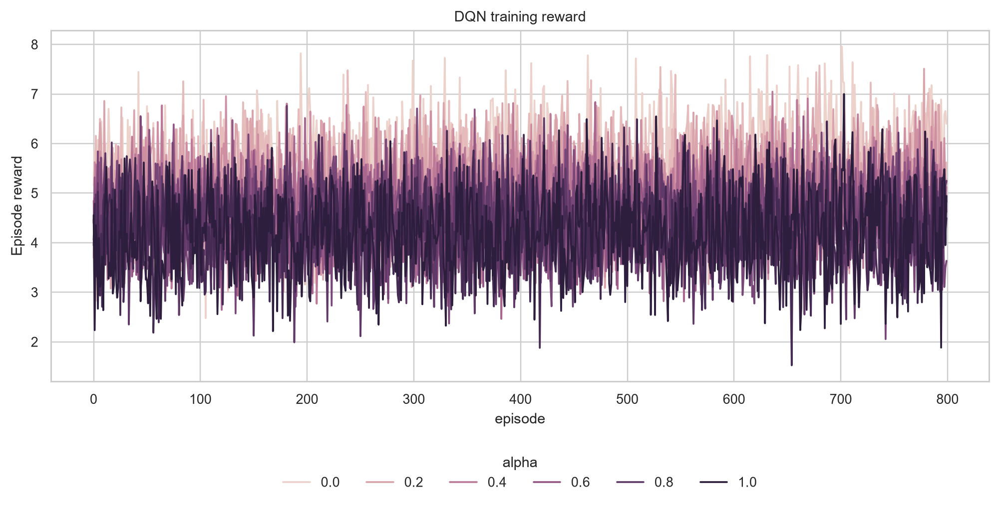
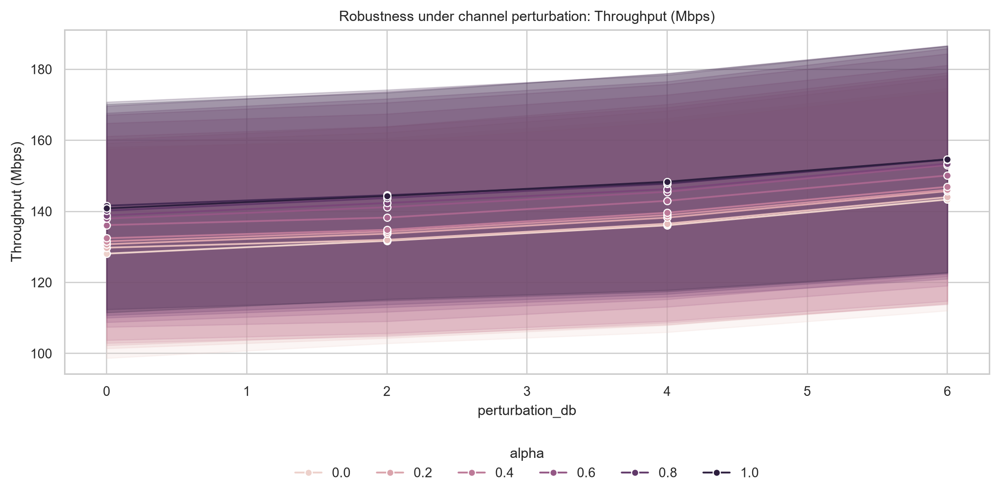

# ISAC DQN Resource Allocation Portfolio

Public portfolio export for a deep reinforcement learning project on resource allocation in Integrated Sensing and Communication (ISAC) systems.

The project studies whether a communication-oriented Deep Q-Network (DQN) power-allocation framework can be extended with sensing-aware state features, a sensing power split, and a reward function that balances communication throughput, sensing utility, and transmit-power cost.

> Scope note: this repository is a cleaned public portfolio version. It intentionally excludes dissertation writing, student identifiers, submission PDFs, appendix forms, LaTeX build outputs, and the original thesis source. The runnable experiment code was not present in the local folder used for this export, so the current repository contains result figures and technical documentation only.

## Project Snapshot

| Area | Details |
| --- | --- |
| Domain | 6G wireless networks, ISAC, resource allocation |
| Learning method | Deep Q-Network policy over discrete downlink power actions |
| Scenario | Multi-cell downlink simulation with communication users and sensing targets |
| Reward design | Weighted communication utility, sensing proxy utility, and power penalty |
| Evaluation | DQN compared against random, fixed-power, and maximum-power baselines |
| Preference sweep | `alpha` values from `0.0` to `1.0` |

## What This Demonstrates

- Formulating an engineering resource-allocation problem as a reinforcement learning task.
- Extending a communication-only power allocation setup with sensing-aware state and reward components.
- Designing experiments that separate training behavior, policy comparison, communication-sensing trade-offs, and robustness checks.
- Communicating simulation outcomes with reproducible result figures and clear limitations.

## Selected Results

As `alpha` increases, the policy shifts toward communication performance. In the dissertation results used for this portfolio export, learned average sensing split decreased from `0.610` to `0.182`, while throughput increased from `132.39 Mbps` to `146.32 Mbps`.


Training behavior and robustness checks are included to make the result story inspectable rather than relying on a single chart.





## Repository Layout

```text
.
|-- README.md
|-- PROJECT_SUMMARY.md
|-- REPRODUCIBILITY.md
|-- PORTFOLIO_SCOPE.md
`-- assets/
    `-- figures/
        |-- dqn_comm_sense_tradeoff.png
        |-- dqn_sensing_split_vs_alpha.png
        |-- training_reward.png
        |-- training_loss.png
        |-- tradeoff_*.png
        `-- robustness_*.png
```

## How To Read This Repository

Start with `PROJECT_SUMMARY.md` for the technical story, then inspect `assets/figures/` for the result evidence. `REPRODUCIBILITY.md` records what code artifacts would be needed to turn this portfolio export into a fully runnable open-source project.

## Current Limitations

- This export does not include runnable source code or trained model files.
- The sensing metric is a simplified simulation proxy, not a radar-grade sensing pipeline.
- The robustness check is limited to an additional channel perturbation case.
- Baselines are sanity-check references, not an exhaustive optimization benchmark.

## Skills Highlighted

Python simulation design, PyTorch-style DQN implementation planning, wireless channel modeling, reward engineering, experiment design, result visualization, and technical communication.
