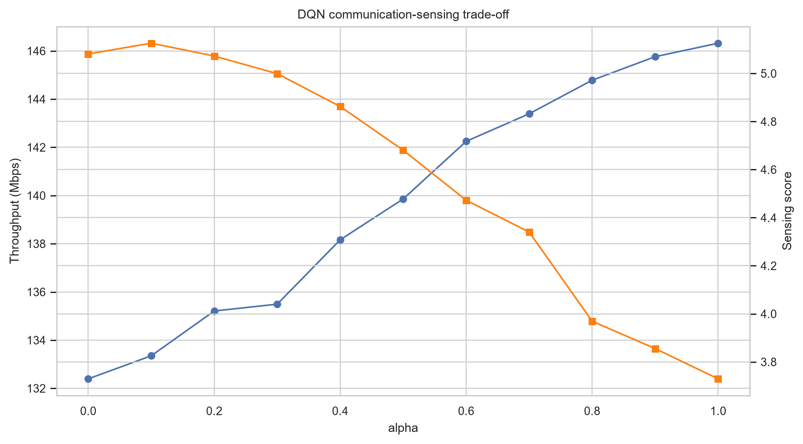
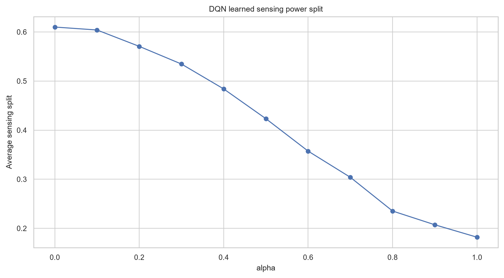

# ISAC DQN 资源分配项目说明

本仓库实现了一个用于集成感知与通信（Integrated Sensing and Communication, ISAC）资源分配问题的 Deep Q-Network（DQN）仿真项目。项目目标是研究学习型功率分配策略如何在不同偏好设置下平衡通信吞吐量、感知效用和发射功率代价。

## 项目背景

ISAC 系统希望复用无线基础设施和无线资源，同时支持数据传输与环境感知。这会带来直接的资源分配权衡：更多通信侧功率通常有利于吞吐量，而更多感知侧资源有利于感知效用。由于信道、干扰、用户位置和感知目标会变化，固定规则难以覆盖所有情况。

本项目将该权衡建模为强化学习问题，并评估 DQN 策略是否会随着通信-感知偏好参数变化而产生合理响应。

## 系统模型

仿真环境采用多小区下行链路场景，每个小区包含通信用户和一个感知目标。

主要组成：

- 离散子带功率动作；
- 感知功率比例；
- 路径损耗、对数正态阴影衰落、瑞利衰落、天线增益和小区间干扰；
- SINR、CQI、吞吐量、感知分数、总功率和奖励指标；
- 使用 `alpha` 控制通信与感知之间的偏好。

奖励函数核心形式为：

```text
r_c = alpha * R_comm,c + (1 - alpha) * R_sense,c - lambda * R_power,c
```

其中 `alpha` 控制通信-感知偏好，`lambda` 是固定功率惩罚系数。

## 传统 Baseline

DQN 策略与以下参考策略比较：

- `random`：随机选择合法动作；
- `fixed_0.8w`：使用固定功率；
- `max_power`：使用最大功率分配；
- `src/isac_dqn/baselines.py` 中还保留了可选 GA 风格搜索辅助函数。

这些 baseline 用于帮助判断学习策略的行为是否合理。

## 深度学习方法

DQN 智能体将环境状态映射到每个小区的离散动作分数。

实现要点：

- 使用 PyTorch Q-network；
- 使用 replay buffer 采样更新；
- 使用 target network 提升训练稳定性；
- 使用 epsilon-greedy 探索；
- 使用 Smooth L1 loss 和 RMSprop 优化器；
- 每个小区对应一个动作输出块。

核心文件：

| 路径 | 作用 |
| --- | --- |
| `src/isac_dqn/environment.py` | 环境状态、动作解析、指标和奖励。 |
| `src/isac_dqn/dqn_agent.py` | Q-network、DQN 更新逻辑和模型保存。 |
| `src/isac_dqn/radio.py` | 无线信道和通信指标辅助函数。 |
| `run_experiment.py` | 训练、评估、CSV 导出和绘图流程。 |

## 实验设置

主要参数位于 `configs/config.yaml`。

| 设置 | 数值 |
| --- | --- |
| 小区数 | `5` |
| 每小区用户数 | `5` |
| 子带数 | `3` |
| 功率等级 | `0.4, 0.6, 0.8, 1.0, 1.2 W` |
| 感知比例等级 | `0.1, 0.3, 0.5, 0.7` |
| 偏好扫描 | `alpha = 0.0, 0.1, ..., 1.0` |
| 每个 alpha 训练轮数 | `800` |
| 评估轮数 | `60` |
| 鲁棒性扰动 | `0, 2, 4, 6 dB` |

## 结果图

结果文件和图表位于 `results/final/`。

随着 `alpha` 增大，策略更偏向通信性能。在包含的结果中，DQN 学到的平均感知功率比例从 `0.610` 降到 `0.182`，平均吞吐量从 `132.39 Mbps` 增加到 `146.32 Mbps`。





训练与鲁棒性图：


## 结论

结果显示，DQN 策略会随通信-感知偏好参数产生预期方向的变化。通信偏好越高，吞吐量越高，学习到的感知功率比例越低。感知分数存在随机波动，因为它受信道和目标条件影响。

本项目是一个基于仿真的 ISAC 资源分配研究；感知分数是简化代理指标，不是完整雷达信号处理链路。

## 改进点

后续可改进方向：

- 增加更强的优化 baseline；
- 评估更多移动性和信道变化场景；
- 扩展当前感知代理指标；
- 为环境约束和奖励计算增加自动化测试；
- 支持从独立 YAML 文件配置多组实验扫描；
- 如需要，可将重新生成的模型权重单独发布。

## 项目结构

```text
.
|-- README.md
|-- README.zh-CN.md
|-- requirements.txt
|-- configs/
|   `-- config.yaml
|-- data/
|-- run_experiment.py
|-- run_quick_test.py
|-- quality_check.py
|-- src/
|   `-- isac_dqn/
|       |-- environment.py
|       |-- dqn_agent.py
|       |-- radio.py
|       |-- baselines.py
|       |-- plotting.py
|       |-- replay_buffer.py
|       `-- utils.py
|-- notebooks/
|-- docs/
`-- results/
    `-- final/
        |-- summary_by_policy.csv
        |-- evaluation_results.csv
        |-- robustness_results.csv
        |-- training_history.csv
        `-- figures/
```

## 快速运行

```powershell
python -m venv .venv
.\.venv\Scripts\Activate.ps1
pip install -r requirements.txt
python run_quick_test.py
```

快速测试会输出到 `results/quick/` 和 `models/quick/`。

运行完整实验：

```powershell
python run_experiment.py
```

运行不包含 GA baseline 的完整实验：

```powershell
python run_experiment.py --no-ga --output-dir results/full_no_ga --model-dir models/full_no_ga
```

检查已包含的结果文件和图表：

```powershell
python quality_check.py --results-dir results/final --skip-models
```
